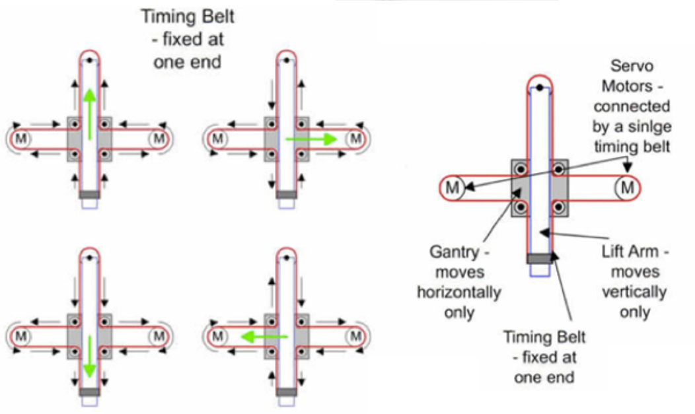
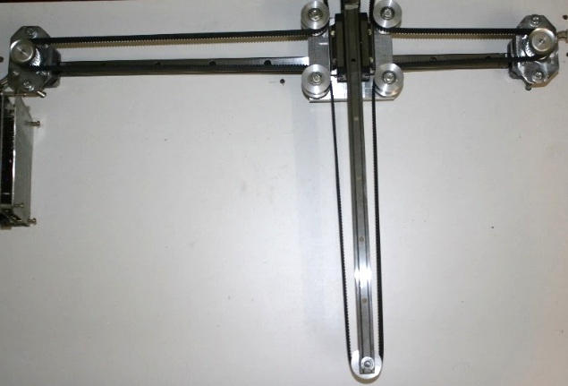
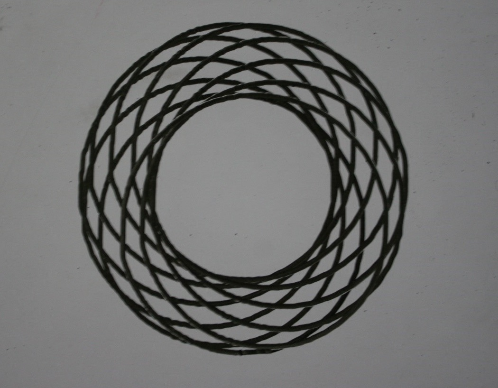
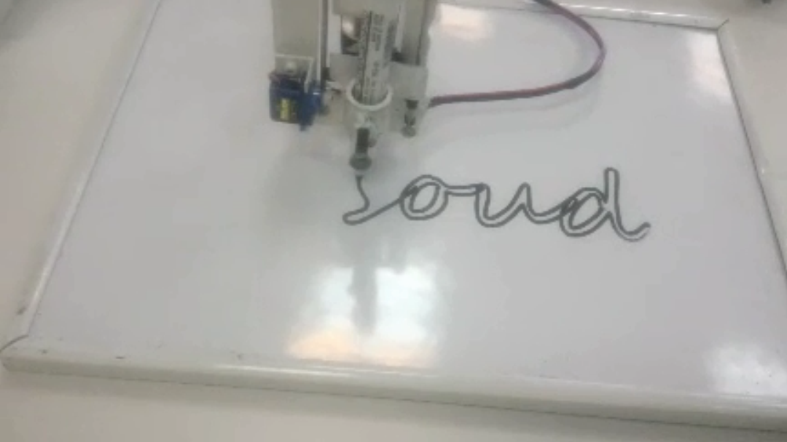
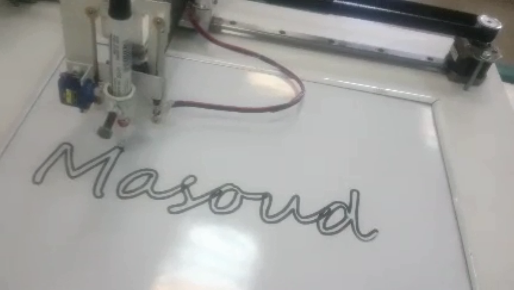

# 2D plotter(Using Pen)
### My bachelor's degree final project
This project is inspired by a device called [AxiDraw](https://www.axidraw.com/). This device holds a pen and then draws like anything that is programmed on it, like a human being. I decided to replicate this device functionality and build a device for myself and decided to present it as my bachelor's degree project.

## Mechanical Structure
This project relies on a mechanical structure called T-bot.

I made the mechanical structure using some CNC machine parts like timing belt, pulleys, rails, and wagons. The advantages of using a T-bot structure is that the motors are fixed and mounted on the chasie and it only needs one timing belt. In this picture two stepper motors are mounted on the sides of one of the rails. The second rail is moving alongside the first one.

## Electronic Hardware
I designed the board for the project using Altium Designer. The board is powered by an Atmega2560. There are two L298 power amplifiers for driving each stepper motor. A 2 by 16 character LCD displays the messages and a 4 by 4 keypad alongside a joystick are utilized to receive input from the user. A little servo motor is mounted on the pen holder which can lift the pen up whenever needed. The board supply is 12 volts and there are 3 switching LM2596 that provide adequate voltages for motors and electronics circuit.

## Software
The code for the project is written in [Arduino](https://www.arduino.cc/). I also wrote a custom library for controlling the T-bot structure in C++.
For testing there I draw some geometric shapes like spirals. These spirals are drawn via calculation of some polar equations. 

For drawing random shapes like humans, first, we need to draw or insert the shape in one of the CNC machine software. The software then outputs in a format called G-code. Conventional CNC machines can interpret this G-code and do the moves. But my Arduino code can not read G-code and only accepts inputs in the form of XY coordinates. So I wrote a Matlab script that reads the G-code file and outputs the XY sequence. 

In the pictures below, you can see my name being written. The drawing is converted from a G-code that I extracted.

